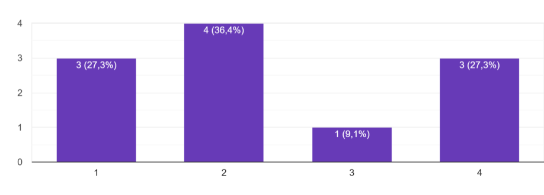
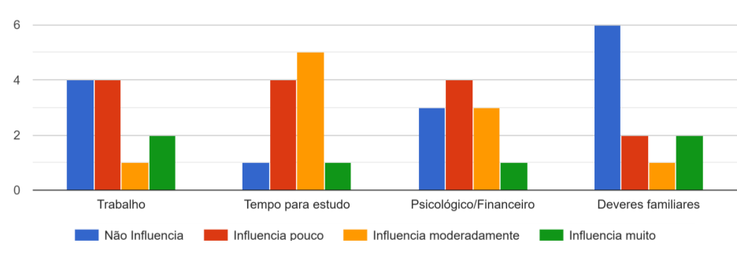
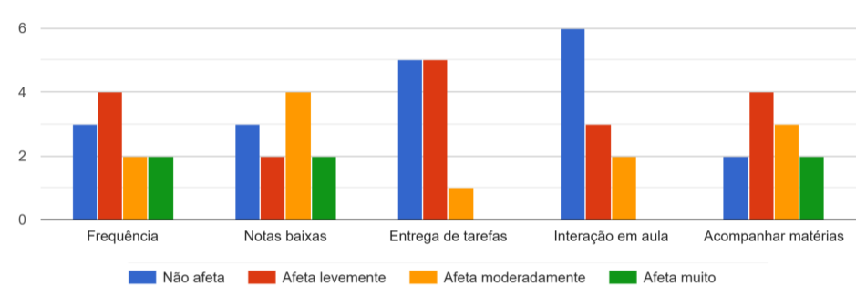
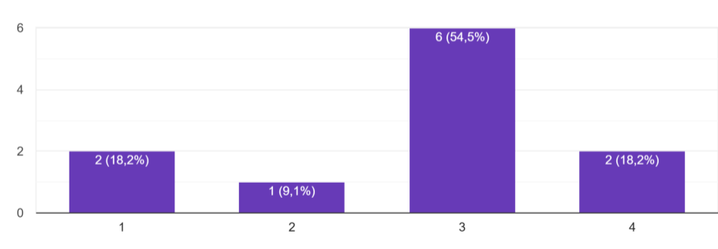
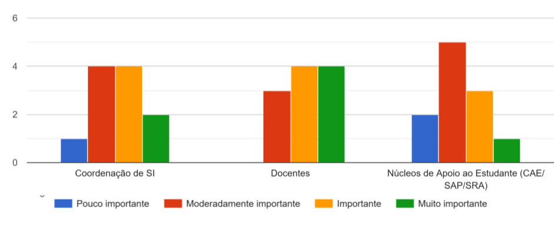

  

<h1 align="center">Retenção-Grad</h1>

  Plataforma inteligente para apoio à permanência estudantil

---

## 📑 Sumário

- [📖 Descrição](#-descrição)
- [🎯 Objetivo](#-objetivo)
- [💡 Proposta de Solução](#-proposta-de-solução)
- [👥 Stakeholders](#-stakeholders)
- [🧠 Técnicas de Elicitação](#-técnicas-de-elicitação)
  - [📋 Entrevista](#-entrevista)
  - [🔎 Análise da Entrevista](#-análise-da-entrevista)
  - [📝 Questionário](#-questionário)
  - [📊 Resultados do Questionário](#-resultados-do-questionário)
- [⚙️ Requisitos do Sistema](#️-requisitos-do-sistema)
  - [✅ Requisitos Funcionais](#-requisitos-funcionais)
  - [🚀 Requisitos Funcionais Evolutivos](#-requisitos-funcionais-evolutivos)
  - [🔒 Requisitos Não Funcionais](#-requisitos-não-funcionais)
- [📖 User Stories](#-user-stories)
- [🎬 Cenários BDD](#-cenários-bdd)
- [📏 Avaliação INVEST](#-avaliação-invest)
- [👨‍💻 Colaboradores](#-colaboradores)
- [🎓 Disciplina](#-disciplina)

## 📖 Descrição

Este repositório apresenta a atividade avaliativa desenvolvida na disciplina de Processos de Software e Engenharia de Requisitos, do Instituto Federal de Educação, Ciência e Tecnologia Farroupilha (IFFar) — Campus São Borja, como requisito parcial para aprovação na disciplina.

O projeto tem como foco o levantamento e a especificação de requisitos do sistema **Retenção-Grad**, uma plataforma proposta para auxiliar no combate à evasão nos cursos de graduação da instituição.

O cenário apresentado descreve um índice preocupante de evasão estudantil identificado pelo IFFar. Como solução, foi proposta uma plataforma inteligente capaz de integrar dados acadêmicos dos estudantes, permitindo a emissão de alertas e o gerenciamento de planos de intervenção.

Atualmente, essas informações encontram-se distribuídas em diferentes sistemas e planilhas manuais, dificultando a identificação rápida de alunos em situação de risco e comprometendo ações preventivas de retenção estudantil.

# 🎯 Objetivo

Identificar quais indicadores acadêmicos e administrativos a coordenação considera críticos para sinalizar o risco de evasão e compreender o fluxo de gestão de trancamentos e planos de intervenção.

# 💡 Proposta de Solução

Um sistema que integra e analisa automaticamente, a partir dos diários de classe, os dados de frequência, desempenho acadêmico e disciplinas cursadas. A plataforma gera alertas automáticos para docentes em caso risco de desistência em disciplinas específicas e para o coordenador quando houver risco de evasão do curso, permitindo ainda o envio de mensagens automatizadas aos estudantes identificados como possíveis desistentes e o encaminhamento direto do aluno aos serviços de assistência estudantil, mantendo um histórico detalhado das comunicações realizadas.  O sistema também conta com o acompanhamento semestral de notas para averiguação do desempenho acadêmico do aluno e sua evolução ao longo do semestre.

# 👥 Stakeholders

### 1. Coordenação de Curso: 
Focada no monitoramento de índices de retenção, análise de desempenho por turma e gestão de trancamentos.

### 2. Docentes: 
Focados em identificar sinais precoces de desinteresse, queda de rendimento e falta de engajamento em sala de aula.

### 3. Núcleo de Apoio ao Estudante (CAE/SAP/SRA): 
Focado em fatores socioeconômicos, apoio psicológico e orientação de carreira para alunos em risco.

# 🧠 Técnicas de Elicitação

## 📋 Entrevista

## Objetivo da Entrevista

A entrevista tem como objetivo compreender os fatores relacionados à evasão estudantil, identificar dificuldades enfrentadas pela instituição no acompanhamento acadêmico e levantar necessidades para o desenvolvimento do sistema **Retenção-Grad**.

## Stakeholder Entrevistado

- Coordenação de Curso

## 📋 Roteiro da Entrevista

### **1. Indicadores de evasão**
Quais indicadores são utilizados para identificar risco de evasão dos alunos? Além de dados métricos (notas, frequência, entregas e acesso ao ambiente virtual), existem fatores não métricos percebidos, como questões socioeconômicas, pessoais ou de trabalho? Como essas informações são registradas e acompanhadas?

### **2. Momento de intervenção**
Em que momento é possível perceber que um aluno está propenso a abandonar o curso e quais critérios orientam a decisão de intervenção da coordenação? Que tipos de ações normalmente são realizadas nesses casos?

### **3. Monitoramento acadêmico**
Como ocorre atualmente o monitoramento do desempenho das turmas e dos alunos? Com que frequência essas análises são feitas e quais dificuldades existem nesse acompanhamento?

### **4. Identificação de problemas**
Quais as maiores dificuldades para identificar eventuais problemas antes que o aluno abandone o curso? De que forma um sistema poderia apresentar informações acadêmicas para permitir a identificação rápida de problemas?

### **5. Planejamento acadêmico e evasão**
Durante o planejamento das disciplinas e horários do semestre, existem estratégias adotadas para reduzir a evasão? A organização da carga horária ou a distribuição das disciplinas influencia na permanência dos alunos? Abandonar uma disciplina representa necessariamente evasão do curso ou são situações distintas?

### **6. Comunicação institucional**
Como ocorre a comunicação entre coordenação, professores e setores de apoio institucional (como CAE/SAP) no acompanhamento de alunos em risco? Existe algum processo ou informação adicional considerado essencial para fortalecer ações de retenção estudantil?

## 🔎 Análise da Entrevista

### Indicadores de evasão

- Indicadores quantitativos (frequência, desempenho, atividades entregues).
- Aluno que frequenta a aula, mas abandona as atividades propostas (sinal de alerta precoce).
- O coordenador não tem acesso direto aos dados socioeconômicos e pessoais no sistema (SIGAA) e não são usados diretamente na análise de evasão, mas essas questões são discutidas em reuniões e esses dados podem ser solicitados se necessário.

### Momento de intervenção

- Duas semanas consecutivas de faltas ou ausências em dias de avaliação (e na véspera) são um sinal de possível evasão.
- A janela de ação deve ser estritamente preventiva.
- Uma vez que o aluno decide abandonar o curso, o contato da coordenação (por telefone, por exemplo) é visto como invasivo, por se tratar de um público adulto.

### Monitoramento acadêmico

- Atualmente é manual e ineficiente. A coordenação precisa baixar dezenas de PDFs de diários de classe SIGAA e planilhas e cruzar faltas e matrículas.
- Em reuniões semanais é discutida a situação das turmas e alunos.
- 90% dos alunos têm matrículas irregulares (não existem "turmas fechadas"). Acompanhar o histórico individual de mais de 100 alunos sem um painel centralizado é inviável.
- Os dados de acesso ao ambiente virtual são restritos aos professores.

### Identificação de problemas

- O sistema atual (SIGAA) apresenta dados desestruturados. Além disso, a irregularidade das matrículas cria "pontos cegos" (não ver o aluno no campus não significa, necessariamente, que ele faltou).
- A solução proposta é uma ferramenta com upload quinzenal de diários que extraia faltas automaticamente e gere alertas de infrequência.
- Em um segundo momento, há o desejo de automatizar a chamada integrando RFID, reconhecimento facial e cartões institucionais.

### Planejamento acadêmico e evasão

- Aulas com quatro períodos contínuos na mesma noite potencializam a evasão (a falta em um único dia causa uma perda enorme de conteúdo). O modelo ideal dividiria essa carga em duas noites.
- A montagem dos horários é travada pela disponibilidade geral dos professores no campus, dificultando o planejamento ideal para o curso.
- Quando os alunos decidem abandonar, geralmente desistem do curso como um todo, embora ocorram abandonos pontuais de disciplinas específicas (como programação).

### Comunicação institucional

- O contato entre coordenação e setores de apoio (SAP, CAE, SRA) é feito por e-mail, pois permite o registro do acompanhamento.
- Entre os professores, realizam reuniões e conversam entre eles quando identificam uma possível evasão.
- A adoção de conselhos de classe na metade do semestre (inspirados no ensino médio integrado) é pensada como uma estratégia de melhoria para identificar riscos e avaliar o desempenho de forma mais rápida e assertiva.

## 📝 Questionário

## Objetivo do Questionário

O questionário tem como objetivo identificar quais fatores acadêmicos, financeiros, psicológicos e sociais mais influenciam a permanência dos estudantes no curso, além de compreender quais formas de apoio institucional são consideradas mais relevantes para auxiliar na redução da evasão estudantil.

## Perguntas do Questionário

### **1. Intenção de evasão**

Com que frequência você já pensou em desistir do curso?

**Escala de resposta:**
- (1) Nunca
- (2) Raramente
- (3) Às vezes
- (4) Frequentemente

### **2. Fatores que influenciam a permanência no curso**

Em que medida os aspectos abaixo influenciam sua permanência no curso?

**Itens avaliados:**
- Trabalho
- Tempo para estudo
- Psicológico/Financeiro
- Deveres familiares

**Alternativas da grade:**
- Não influencia
- Influencia pouco
- Influencia moderadamente
- Influencia muito

### **3. Impactos das dificuldades no desempenho acadêmico**

Quando apresenta dificuldades, o quanto elas costumam afetar os aspectos acadêmicos abaixo?

**Itens avaliados:**
- Frequência
- Notas baixas
- Entrega de tarefas
- Interação em aula
- Acompanhar matérias

**Alternativas da grade:**
- Não afeta
- Afeta levemente
- Afeta moderadamente
- Afeta muito

### **4. Retorno percebido do esforço acadêmico**

Você sente que o esforço dedicado às disciplinas está sendo compensado pelo conhecimento adquirido?

**Escala de resposta:**
- (1) Não sinto retorno vindo do esforço
- (2) Sinto pouco retorno
- (3) Sinto retorno moderado
- (4) Sinto forte retorno e motivação

### **5. Importância dos apoios institucionais**

Quais apoios institucionais você considera mais importantes para ajudar estudantes a permanecer no curso?

**Itens avaliados:**
- Coordenação de SI
- Docentes
- Núcleo de apoio ao estudante (CAE, SAP, SRA)

**Alternativas da grade:**
- Pouco importante
- Moderadamente importante
- Importante
- Muito importante

## 📊 Resultados do Questionário

### Frequência de pensamentos sobre desistência do curso
Pergunta 1: Com que frequência você já pensou em desistir do curso?  
(1 - Nunca / 4 - Frequentemente)

  

Conforme o gráfico, das 11 respostas obtidas, a maioria se concentra em frequências baixas. No entanto, o número de pessoas que nunca pensaram em desistir se iguala ao de quem pensa frequentemente. 

### Influência de fatores na permanência estudantil
Perguntas 2: Em que medida os aspectos abaixo influenciam sua permanência no curso?

  

Este outro gráfico mostra que o tempo para estudo e questões psicológicas e financeiras são aspectos de influência mais constante desistência do curso. Contudo, o trabalho e deveres familiares destacam-se com maior peso (influencia muito).

### Impacto das dificuldades no desempenho acadêmico
Pergunta 3: Quando apresenta dificuldades, o quanto elas costumam afetar os aspectos acadêmicos abaixo?

  

Conforme o levantamento, o que mais afeta academicamente um aluno quando apresenta dificuldades são notas baixas (impacto moderado)  e o acompanhamento das matérias. 

### Retorno percebido do esforço acadêmico
Pergunta 4: Você sente que o esforço dedicado às disciplinas está sendo compensado pelo conhecimento adquirido?  
(1 - Não sinto retorno do esforço / 4 - Sinto forte retorno e motivação)

  

Este outro gráfico demonstra que o retorno percebido pelo esforço acadêmico é primariamente positivo, apresentando apenas 2 respostas realmente negativas.

### Importância dos apoios institucionais

Pergunta 5: Quais apoios institucionais você considera mais importantes para ajudar estudantes a permanecer no curso?

  

Este último gráfico mostra que os apoios institucionais mais valorizados são dos docentes e da coordenação do curso.

# ⚙️ Requisitos do Sistema

## ✅ Requisitos Funcionais

### RF001 — Visualizar alunos em risco de evasão
O sistema deve exibir para o coordenador do curso uma lista contendo os alunos identificados com propensão à evasão, apresentando o nível de risco (alto, médio, baixo) e os dados básicos de identificação.

### RF002 — Pesquisar alunos
O sistema deve permitir ao coordenador do curso pesquisar os alunos do curso de SI para uma consulta rápida.

### RF003 —  Importar diários de classe
O sistema deverá permitir que o docente ou coordenador importe o diário de classe de cada disciplina.

### RF004 — Gerar acompanhamento individual do aluno
O sistema deverá exibir em um painel os dados individuais de cada aluno, as disciplinas cursadas, mostrando o histórico acadêmico (notas e frequência) e o alerta ligado a ele.

### RF005 — Identificar automaticamente o risco de infrequência de cada disciplina
O sistema deverá identificar e emitir ao docente um alerta de desistência da disciplina após duas faltas consecutivas.

### RF006 — Identificar riscos de evasão
O sistema deve processar os dados cadastrais, acadêmicos e comportamentais previamente registrados para identificar automaticamente alunos com potencial risco de evasão quando ocorre alerta de infrequência em várias disciplinas, exibindo um alerta aos coordenador do curso.

### RF007 — Importar e analisar semestralmente as notas
O sistema deve permitir a importação das notas finais do semestre para compor o histórico de desempenho do aluno.

### RF008 — Enviar mensagens para alunos com risco de evasão
O sistema deve gerar mensagens pré-formatadas e enviar por e-mail para alunos que estão com risco de desistência da disciplina ou risco de evasão.  

### RF009 — Encaminhar alunos para grupos de apoio estudantil
O sistema deve permitir ao coordenador encaminhar os estudantes com risco de evasão aos grupos de apoio estudantil.

### RF010 — Gerenciar encaminhamento aos grupos de apoio
O sistema deve permitir aos grupos de apoio estudantil confirmar encaminhamento, agendar horário e após a data marcada confirmar comparecimento do estudante.

### RF011 — Importar atas
O sistema deve permitir aos grupos de apoio estudantil importar atas da reunião ao sistemas se necessário.

### RF012 — Exibir histórico de intervenção
O sistema deve mostrar datas das mensagens automáticas enviadas, encaminhamentos, registro de comunicação externos e alertas dos docentes.

## 🚀 Requisitos Funcionais Evolutivos

### RFE001 — Importação dos conselhos de classe
O sistema poderá permitir a importação de registros e observações provenientes dos conselhos de classe, auxiliando na identificação de padrões relacionados ao desempenho e permanência dos estudantes.

### RFE002 — Registro automatizado de presença
O sistema poderá realizar o registro automatizado de presença dos estudantes por meio de integrações futuras com sistemas institucionais ou tecnologias de controle de acesso.

## 🔒 Requisitos Não Funcionais

### RNF001 — Interoperabilidade de formatos
O sistema deverá operar de forma independente do SIGAA, não exigindo integração direta com a plataforma para recebimento e processamento de dados acadêmicos.

### RNF002 — Segurança e privacidade de dados sensíveis
O sistema deverá garantir a proteção e confidencialidade dos dados acadêmicos, pessoais e socioeconômicos dos estudantes, restringindo o acesso às informações conforme o perfil institucional do usuário.

### RNF003 — Periodicidade do processamento de indicadores
O sistema deverá processar e atualizar os indicadores de evasão em intervalos máximos de 15 dias, garantindo informações recentes para acompanhamento institucional.

# 📖 User Stories

## User Story #01: Visualizar alunos em risco de evasão

### Card
**Como** Coordenador do Curso,  
**eu quero** ver uma lista com todos os alunos e que classifique-os em diferentes níveis de risco de evasão,  
**para** tomar medidas preventivas que evitem a desistência do curso.

### Conversation
- O sistema deve exibir uma listagem contendo os seguintes dados de cada aluno matriculado no curso: nome, matrícula, semestre e nível de risco (Urgente, Alto, Médio, Baixo, Sem Risco);
- A ordenação padrão da lista deve ser decrescente, priorizando a exibição dos alunos classificados como "Risco Urgente" no topo;
- O sistema deve utilizar indicadores visuais (cores ou ícones) para destacar e diferenciar os cinco níveis de risco na listagem;
- A listagem deve ser paginada, exibindo um limite máximo de 25 alunos por página;
- A listagem deve servir como ponto de partida: ao interagir com o registro de um aluno, o coordenador será direcionado para o perfil detalhado dele;
- Caso não existam alunos cadastrados, o sistema deve exibir uma mensagem indicando que a lista está vazia (estado vazio);

### Confirmation
- [ ] O painel do coordenador deve renderizar uma tabela contendo exatamente as colunas: nome, matrícula, semestre e risco de evasão;
- [ ] A tabela deve organizar as linhas automaticamente por gravidade, fixando os alunos em “Risco Urgente” (roxo) no topo, seguidos de "Risco Alto" (vermelho), “Risco Moderado” (laranja), “Risco Baixo” (amarelo) e, por último, “Sem Risco” (Branco);
- [ ] As linhas da tabela devem ser clicáveis, funcionando como um ponto de acesso ao painel de acompanhamento individual de cada aluno;
- [ ] O sistema deve exibir controles de paginação como botões de "Próximo", "Anterior" e números das páginas no rodapé da tabela caso o total ultrapasse mais de 25 alunos importados;
- [ ] O sistema deve exibir uma mensagem de estado vazio na tela caso não haja dados para listar.  

## User Story #02: Importar diários de classe

### Card
**Como** Docente ou Coordenador do Curso,  
**eu quero** realizar o upload do diário de classe de minhas disciplinas,  
**para** que o sistema possa processar e extrair automaticamente os dados dos alunos matriculados nela.

### Conversation
- O upload dos diários deverá ser realizado de forma quinzenal (prazo máximo de 15 dias para atualização); 
- O sistema deve aceitar e processar exclusivamente arquivos PDF originais gerados pelo SIGAA, extraindo: semestre, matrícula, nomes, datas de aulas e presenças;
- O sistema deve processar o arquivo importado e atualizar os dados de frequência da disciplina correspondente; 
- Após uma importação bem-sucedida, o sistema deve exibir uma mensagem confirmando a atualização dos dados da disciplina; 
- Arquivos que não sejam PDF, que tenham estrutura inválida ou que ultrapassem o limite de 50 MB devem ser rejeitados, exibindo uma mensagem de erro;  
- O sistema deve exibir um indicador de carregamento enquanto processa o arquivo, bloqueando novos envios até a conclusão;
- Uma mensagem de alerta de urgência deve aparecer na tela do docente ou coordenador faltando 3 dias para o vencimento do prazo de 15 dias, sendo removida após envio.

### Confirmation
- [ ] O sistema deve bloquear caso o arquivo seja maior que 50 MB, não seja PDF ou não tenha a estrutura do SIGAA;
- [ ] O sistema não deve permitir o upload dos diários de classe após 3 dias após o prazo quinzenal;
- [ ] O alerta de urgência deve ser removido da tela do docente assim que um diário for importado com sucesso.  

## User Story #03: Identificar riscos de evasão

### Card
**Como** Coordenador do Curso,  
**eu quero** que sejam identificado os possíveis riscos de evasão do curso,  
**para** que os alunos sejam identificados e ações preventivas aconteçam para evitar o abandono definitivo do curso.

### Conversation
- O sistema deve cruzar a frequência atual do aluno (obtida via importação quinzenal de diários) com seu histórico de notas;
- O parâmetro para definir "Risco Urgente" de evasão é a combinação de baixa frequência em três ou mais disciplinas simultâneas e baixo desempenho acadêmico; 
- O parâmetro para definir "Alto Risco" de evasão é a combinação de baixa frequência em três ou mais disciplinas simultâneas; 
- O parâmetro para definir "Risco Moderado" de evasão é a combinação de baixa frequência em duas ou mais disciplinas simultâneas ou baixo desempenho acadêmico; 
- O parâmetro para definir "Risco Baixo" é a indentificação de baixa frequência em uma disciplina;
- O parâmetro para definir "Sem risco" frequência regular em todas as matérias e bom desempenho acadêmico;
- Ao calcular essa probabilidade, o sistema deve atualizar o status do aluno automaticamente para que a listagem do painel exiba os indicadores apropriados;
- Baixo desempenho acadêmico representa a média das notas da disciplinas cursadas <= 6.

### Confirmation
- [ ] Quando o sistema identificar um aluno com faltas equivalentes a 24% da frequência ou faltas consecutivas em duas semanas em três ou mais disciplinas e as médias das notas do aluno for <=6, o status do aluno deve ser classificado e gravado como “Risco Urgente”;
- [ ] Quando o sistema identificar um aluno com faltas equivalentes a 24% da frequência ou faltas consecutivas em duas semanas em três ou mais disciplinas, o status do aluno deve ser classificado e gravado como “Risco Alto”;  
- [ ] Quando o sistema identificar um aluno com faltas equivalentes a 24% da frequência ou faltas consecutivas em duas semanas em duas disciplinas, ou as médias das notas do aluno for <=6, o status do aluno deve ser classificado e gravado como “Risco Moderado”;
- [ ] Quando o sistema identificar um aluno com faltas equivalentes a 24% da frequência ou faltas consecutivas em duas semanas em uma disciplina, o status do aluno deve ser classificado e gravado como “Risco baixo”;
- [ ] Demais alunos devem ter o status classificado e gravado como “Sem Risco”. 

## User Story #04: Identificar risco de infrequência de cada disciplina

### Card
**Como** Docente,  
**eu quero** que o sistema indentifique automáticamente caso um aluno tenha duas faltas consecutivas ou quatro faltas acumuladas em minha disciplina,  
**para** realizar uma intervenção antecipadamente.

### Conversation
- O sistema deve processar as frequências registradas através da importação dos diários de classe; 
- O sistema deve emtir uma alerta ao identificar a ocorrência de faltas de duas semanas consecutivas de um aluno em uma mesma matéria, alterando o status desse aluno naquela matéria para "Risco de desistência da disciplina” e exibir um alerta visual no painel do docente;
- Duas semanas de faltas consecutivas significam ausência em duas aulas sequenciais registradas no diário (dias sem aula ou feriados não afetam a contagem);
  - Matérias 72 horas-aula: significa um total de 8 faltas consecutivas;
  - Matérias 36 horas-aula: significa um total de 4 faltas consecutivas;
- O sistema deve identificar alunos com 24% de faltas na disciplina, alterando o status desse aluno naquela matéria para "Risco de desistência da disciplina” e exibir um alerta visual no painel do docente;
  - Matérias 72 horas-aula: significa um total de 16 faltas;
  - Matérias 36 horas-aula: significa um total de 8 faltas;
- O sistema deve remover o alerta visual do painel quando, em uma nova importação de diário, for identificada uma presença do aluno com data posterior ao alerta. 

### Confirmation
- [ ] O sistema deve validar a sequência de faltas sempre que houver uma importação de diário de classe. 
- [ ] O alerta deve ser visível na interface restrita do docente que ministra aquela disciplina.
- [ ] Deve ser gerado um alerta  após o registro da segunda semana de falta consecutiva.
- [ ] Deve ser gerado um alerta quando o aluno atingir 24% de faltas.

## User Story #05: Enviar mensagens para alunos com risco de evasão

### Card
**Como** Coordenador do Curso,  
**eu quero** enviar mensagens pré-formatadas aos alunos com risco de evasão,  
**para** facilitar o contato com os estudantes.

### Conversation
- Apenas alunos identificados com risco moderado de evasão ou superior podem receber mensagens automáticas.
- O sistema deve permitir que o coordenador revise a mensagem antes do envio.
- O envio da mensagem deve ocorrer somente após confirmação manual do coordenador.
- O sistema deve registrar data, horário e responsável pelo envio da mensagem.
- Alunos com status “Trancado” ou “Cancelado” não devem receber notificações.

### Confirmation
- [ ] O sistema deve gerar mensagens automáticas com padrão institucional para alunos em risco de evasão.
- [ ] A mensagem deve conter nome do aluno e motivo do alerta.
- [ ] O coordenador deve poder editar a mensagem antes do envio.
- [ ] O envio da mensagem deve ser registrado no histórico do aluno.
- [ ] Alunos com mensagens pendentes de envio devem possuir um alerta visual na lista de alunos em risco de evasão.
- [ ] Após o envio da mensagem ou após o coordenador optar por não enviá-la, o alerta deve ser removido automaticamente da lista de alunos em risco.

# 🎬 Cenários BDD

## Cenário #01: Visualizar alunos em risco de evasão

### Cenário: coordenador acessa o sistema para visualizar os alunos
### 01 Cenário Fluxo Principal
Dado que existem alunos cadastrados e classificados no sistema, como “Maria” (Risco Urgente), “João” (Risco Alto), "Pedro" (Risco Moderado), "Ana" (Risco Baixo) e “Marcos” (Sem Risco)  
Quando o coordenador “Rafael” acessar a tela de monitoramento  
Então o sistema deve renderizar uma tabela com as colunas: Nome, Matrícula, Semestre e Risco de Evasão  
E a linha de “Maria” deve aparecer na primeira posição destacada com a cor roxa  
E a linha de “João” deve vir abaixo na cor vermelha  
E a linha de “Pedro” deve vir abaixo na cor laranja  
E a linha de “Ana” deve vir abaixo na cor amarelo  
E a linha de “Marcos” deve estar na base da lista com a cor branca  

### Cenário: coordenador busca os dados detalhados do aluno
### 01 Cenário Fluxo Alternativo
Dado que o coordenador “Rafael” visualiza a tabela dos alunos em risco de evasão  
Quando o coordenador realiza um clique sobre a linha da aluna “Maria”  
Então o sistema direciona o coordenador para a tela de acompanhamento individual da respectiva aluna.  

## Cenário #02: Importar diários de classe

### Cenário: docente realiza importação do diário de classe
#### 02 Cenário Fluxo Principal
Dado que o professor “Rafael” está logado no sistema e acessa a área de importação da disciplina de "Processos de Software e Engenharia de Requisitos”  
E o arquivo selecionado "diario_disciplina.pdf" possui 15 MB e está no formato correto  
Quando “Rafael” confirma o envio do arquivo  
Então o sistema exibe o indicador de carregamento bloqueando a tela para novos envios  
E extrai a matrícula, nome, datas e presenças dos alunos registrados no PDF  
E exibe a mensagem "Diário importado com sucesso" após o processamento.  

### 02 Cenário Fluxo Alternativo
#### Cenário: docente importa arquivo acima do limite
Dado que o docente “Pedro” anexa o arquivo "historico_completo_turmas.zip" para a importação  
E o tamanho verificado do sistema é 55 MB  
Quando “Pedro” clica no botão de confirmar o envio  
Então o sistema cancela a operação imediatamente sem exibir o indicador de carregamento  
E exibe uma mensagem de erro informando que o arquivo excede o tamanho máximo suportado   
E nenhum registro da disciplina é alterado no banco de dados.  

## Cenário #03: Enviar mensagens para alunos com risco de evasão

### 03 Cenário Fluxo Principal
#### Cenário: coordenador envia mensagem para aluno identificado em risco
Dado que o aluno "João" está marcado como "Alto Risco"  
e "João" possui duas semanas consecutivas de infrequência  
Quando o coordenador confirma o envio da mensagem pré-formatada  
Então o sistema envia a mensagem para "João"  
e registra o envio no histórico do aluno  
e remove o alerta de mensagem pendente da lista de risco.  

### 03 Cenário Fluxo Alternativo
#### Cenário: aluno em risco sem contato cadastrado
Dado que o aluno "João" está marcado como "Alto Risco"  
e "João" não possui e-mail cadastrado  
Quando o coordenador visualizar os alertas de evasão  
Então o sistema deve identificar "João" como "sem contato disponível"  
E deve exibir um alerta informando a ausência de contato cadastrado.  

# 📏 Avaliação INVEST

As User Stories foram avaliadas utilizando o modelo INVEST, que auxilia na verificação da qualidade e adequação das histórias de usuário para o processo de desenvolvimento.

| User Story | Independente (I) | Negociável (N) | Valiosa (V) | Estimável (E) | Pequena (S) | Testável (T) | Justificativa |
|------------|------------------|----------------|-------------|---------------|-------------|--------------|---------------|
| US01 – Visualizar alunos em risco de evasão | ✅ | ✅ | ✅ | ✅ | ✅ | ✅ | Possui valor direto para o coordenador, critérios de aceitação bem definidos e pode ser implementada de forma independente. |
| US02 – Importar diários de classe | ✅ | ✅ | ✅ | ✅ | ✅ | ✅ | Permite alimentar o sistema com os dados necessários para análise acadêmica e geração de alertas. |
| US03 – Identificar riscos de evasão | ❌ | ✅ | ✅ | ✅ | ✅ | ✅ | Depende dos dados importados pelos diários de classe, mas possui regras claras para classificação dos níveis de risco. |
| US04 – Identificar risco de infrequência de cada disciplina | ❌ | ✅ | ✅ | ✅ | ✅ | ✅ | Requer a importação prévia dos diários, porém apresenta critérios objetivos para emissão de alertas. |
| US05 – Enviar mensagens para alunos com risco de evasão | ❌ | ✅ | ✅ | ✅ | ✅ | ✅ | Depende da identificação prévia de alunos em risco, mas possui valor próprio e critérios verificáveis. |

## Legenda

- ✅ Atende ao critério.
- ❌ Não atende ao critério

# 👨‍💻 Colaboradores

### Naiele de Avila Fagundes
📍 Instituição: Instituto Federal de Educação, Ciência e Tecnologia Farroupilha (IFFAr) — Campus São Borja  
🐙 GitHub: https://github.com/NaieleFagundes  
✉️ email: `naiele.11092@aluno.iffar.edu.br`

### Lian Lago Silva
📍 Instituição: Instituto Federal de Educação, Ciência e Tecnologia Farroupilha (IFFAr) — Campus São Borja  
🐙 GitHub: https://github.com/lian14s  
✉️ email: `lian.41056@aluno.iffar.edu.br`

### Raiane da Silva Silveira
📍 Instituição: Instituto Federal de Educação, Ciência e Tecnologia Farroupilha (IFFAr) — Campus São Borja  
🐙 GitHub: https://github.com/Raiane-ssilva  
✉️ email: `raiane.42080@aluno.iffar.edu.br`

### Tiago Flores da Silva
📍 Instituição: Instituto Federal de Educação, Ciência e Tecnologia Farroupilha (IFFAr) — Campus São Borja  
🐙 GitHub: https://github.com/floresTiago  
✉️ email: `tiago.85032@aluno.iffar.edu.br`

# 🎓 Disciplina
**Processos de Software e Engenharia de Requisitos**  

Instituto Federal de Educação, Ciência e Tecnologia Farroupilha — Campus São Borja  

Docente: *Rafael Baldiati Parizi*  

Semestre: *2026/1*

 

  
  

